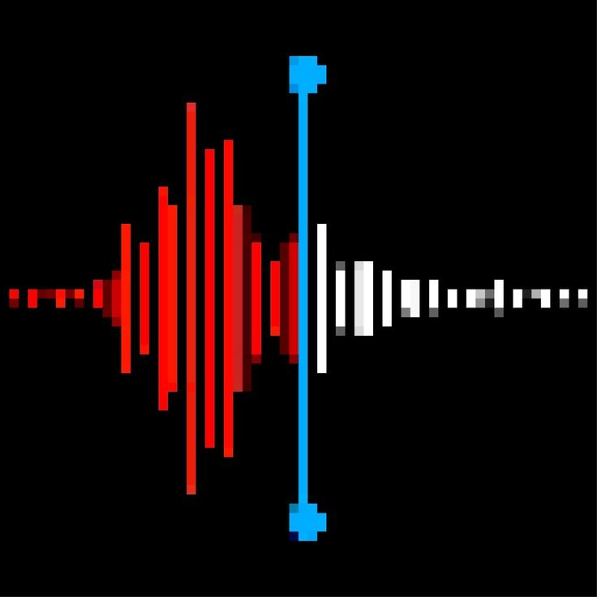

<!--
  README TEMPLATE — Talky
  Replace anything in [BRACKETS], swap the banner/logo images, and fill in
  the actual libraries/commands once the implementation is finalized.
-->

<p align="center">
  
</p>

<h1 align="center">Talky</h1>
<p align="center">
  A simple, fully offline Speech-to-Text and Media-to-Text tool
</p>

<p align="center">
  
  
  
  
  
</p>

<p align="center">
  <a href="https://github.com/martenzo7"></a>
  <a href="https://linkedin.com/in/osman-fahdawi"></a>
  <a href="mailto:martenzo7@proton.me"></a>
</p>

<p align="center">
  
</p>

> ⚠️ **Still under active development.** Features, APIs, and usage may
> change without notice. Not yet recommended for production use.

---

## 📌 Project Overview

In an era where effective communication and accessibility are paramount,
the demand for reliable speech recognition technology continues to grow.
**Talky** is a simple speech-to-text and media-to-text script that bridges
the gap between voice and text conversion seamlessly and efficiently —
**entirely offline**, with no dependency on cloud processing or an internet
connection.

## ✨ Key Features

- **🔌 Offline Functionality** — Unlike many speech recognition systems that
  rely on cloud processing, Talky is designed to operate entirely offline.
  This ensures user privacy, security, and the ability to function in
  environments with limited or no internet access.
- **🎙️ Speech Recognition** — Converts spoken words into text with high
  accuracy using offline speech recognition libraries, capable of
  transcribing multiple languages and dialects.
- **🎬 Media-to-Text Conversion** — Extracts and transcribes audio from
  media files (videos, recordings), useful for content creators, educators,
  and professionals generating transcripts from lectures, presentations, or
  recorded meetings.
- **🖥️ User-Friendly Interface** — A clean, intuitive interface for
  starting, stopping, and saving transcriptions with minimal effort —
  accessible to users of any technical background.
- **⚙️ Customizable Options** — Configure language settings, audio input
  sources, and supported input formats to fit your needs.
- **⚡ Real-Time Feedback** — Immediate visual feedback on recognized text
  as you speak, allowing corrections and adjustments on the fly.
- **📄 Text Output Options** — Save transcriptions as plain text (`.txt`) or
  rich text (`.rtf`), ready for documentation, note-taking, or editing.
- **🌍 Multilingual Support** — Supports multiple languages and dialects,
  suited to a global audience — multinational organizations, educational
  institutions, and beyond.

## 🛠️ Technical Implementation

Talky uses offline speech recognition algorithms and libraries that
function effectively without relying on cloud-based services. By
leveraging offline models, the application achieves high accuracy and
responsiveness in real-time scenarios. The codebase is structured for
optimal performance and seamless integration across Windows, macOS, and
Linux.

<p>
  
  
</p>

Talky is built on [**Vosk**](https://alphacephei.com/vosk/), an offline
speech recognition toolkit (bundled here as `libvosk.dll` / `libvosk.so`),
paired with [`sounddevice`](https://python-sounddevice.readthedocs.io/) for
live microphone input.

## 💡 Use Cases

- **Content Creation** — Bloggers, YouTubers, and podcasters can transcribe
  spoken content into written format, streamlining captions, descriptions,
  and scripts.
- **Education** — Students and educators can transcribe lectures and
  discussions, making note-taking and study prep easier.
- **Accessibility** — Helps individuals with hearing impairments engage
  with audio content by converting speech into readable text.
- **Professional Documentation** — Business meetings, interviews, and
  discussions can be transcribed for accurate records and better
  productivity.

## 🚀 Getting Started

```bash
git clone https://github.com/martenzo7/talky.git
cd talky
pip install -r requirements.txt
```

You'll also need a [Vosk model](https://alphacephei.com/vosk/models) for
your target language — download one and point Talky at it with `-M`/`--model`
(see options below).

```bash
./talky -h
```
```
options:
  -h, --help            show this help message and exit
  -v, --verbose {-1,0,1}
                        Verbose modes -1, 0 and 1 each has different detailing level (default=0).
  -f, --file FILE       Path to the input media file. Ex: mp3 or mp4
  -l, --list            List all connected microphones
  -m, --mic MIC         Microphone index.
  -M, --model MODEL     Model index.
```

```bash
./talky -l                          # list available microphones
./talky -m 1 -M 0                   # live transcription from mic 1, using model 0
./talky -f lecture.mp4 -M 0         # transcribe an audio/video file
./talky -f audio.wav -M 0 -v 1      # transcribe with verbose output
```

## 📁 Project Structure

```
├── talky                # main entry point (executable script)
├── sounddevice.py        # microphone input handling
├── libvosk.dll           # Vosk speech engine (Windows)
├── libvosk.so            # Vosk speech engine (Linux)
├── requirements.txt
└── assets/
    ├── logo.png
    └── banner.png
```

## 🗺️ Roadmap

- [ ] [Core offline transcription engine integration]
- [ ] [Media file audio extraction pipeline]
- [ ] [Real-time microphone transcription]
- [ ] [Multilingual model support]
- [ ] [Export to .txt / .rtf]
- [ ] [Simple GUI]

## 🤝 Contributing

This project is still under development — issues, suggestions, and pull
requests are welcome. Please open an issue before submitting a large PR so
we can discuss the approach first.

## 📬 Contact

<p>
  <a href="https://github.com/martenzo7"></a>
  <a href="https://linkedin.com/in/osman-fahdawi"></a>
  <a href="mailto:martenzo7@proton.me"></a>
</p>

## 📄 License

This project is licensed under the [MIT License](LICENSE).
